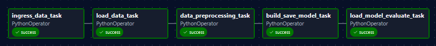
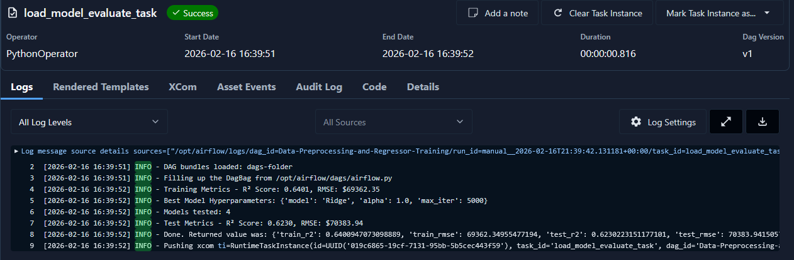

# ie7343-mlops-lab3

This lab submission is a modification of `Labs/Airflow_Labs/Lab_1` in the main repo.

The starter code for that lab does k-mean clustering using the elbow method to find optimal "k" to use.

It defined the the following steps:
- `load_data` to read csv
- `data_preprocessing` to preprocess the data
- `build_save_model` to build k-means, save to file, and return SSE values
- `load_model_elbow` find the optimal number of cluster via elbow method

Our submmission changes the following:
- Replace k-means clustering and starter dataset with a linear regression model for median_house_value prediction
- Add an ingress step that splits raw data into train.csv and test.csv
- Add hyperparameter search with cross-validation to pick the best regressor
- Save model artifacts to working_data/model for reuse
- Use extended variant of airflow container to map in dependencies using uv

## Pipeline Overview

The pipeline ingests the raw housing data from working_data/data.csv, splits it into
train and test sets, preprocesses numeric features, and trains a linear regressor with
hyperparameter tuning. The best model is saved to working_data/model and then evaluated
on the held-out test set to report metrics and sample predictions.

- ingress_data_task: Read raw data from working_data/data.csv and split into train.csv and test.csv
    - This task exists to mock out the process of loading some external dataset and import it in
- load_data_task: Load training data from working_data/train.csv
- data_preprocessing_task: Preprocess numeric features and scale inputs
- build_save_model_task: Tune, train, and save the best regression model and artifacts to working_data/model
- load_model_evaluate_task: Evaluate on the test split and log metrics

## Pipeline Inputs and Outputs

Inputs:
- working_data/data.csv: Raw housing dataset with numeric features and target column median_house_value

Outputs:
- working_data/train.csv: Train split created by ingress step
- working_data/test.csv: Test split created by ingress step
- working_data/model/model.sav: Saved model package (best regressor, scaler, feature names, tuning metadata)
- Logged metrics: Training and test R² and RMSE, plus sample predictions

## Running

1. Install the [uv](https://github.com/astral-sh/uv) package manager. Following instructions assumes you have docker installed are running in linux-like environment.
2. Install deps with `uv sync`
3. Start Airflow
    - Check you have enough RAM in docker engine (at least 4G) by running `docker run --rm "debian:bullseye-slim" bash -c 'numfmt --to iec $(echo $(($(getconf _PHYS_PAGES) * $(getconf PAGE_SIZE))))'`
    - Create required folder structure with `bash setup-airflow.sh`
    - Setup and run the compose with `bash run-airflow.sh`
4. Go to [http://localhost:8080/](http://localhost:8080/) which is the airflow webserver. The username and passcode are `airflow`. 
5. Go to `Dags` tab, then run the DAG. After running check the final step for logged metrics and observe the pickled `working_data/model/model.sav` which contains metrics and the model.

